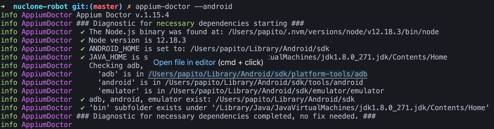

<h1 align="center">
    
</h1>


# POC RobotFramework + DAKI

Prova de conceito de automação do app Daki com RobotFramework


## O tem aqui:

- ✅ testes mobile
- ✅ apk daki assinatura 573edd0945ff6ae72e7cf0bfc5a178b8d525a7c5


## 🗒️ Pré-requisitos

Você vai precisar das seguintes ferramentas e tecnologias:

- [Python](https://www.python.org/downloads/)
- [Node.js](https://nodejs.org/en/)
- [Java JDK11](https://www.oracle.com/br/java/technologies/javase/jdk11-archive-downloads.html)
- [Android Studio](https://developer.android.com/studio/index.html?hl=pt-br)
- [Appium](http://appium.io/downloads.html)
- [Robot Framework](https://robotframework.org/)

## 💻 Ferramentas

 [JDK 11 ](https://www.oracle.com/br/java/technologies/javase/jdk11-archive-downloads.html).

[Android Studio](https://developer.android.com/studio/index.html?hl=pt-br)

##  Variáveis de ambiente (para Linux)

Configure as seguintes váriávies de ambiente no **bash_profile** ou **zshrc** do seu Linux ou Mac:

```bash
export JAVA_HOME=$(/usr/libexec/java_home -v 1.8)
export ANDROID_HOME=~/Library/Android/sdk

PATH=$PATH:$ANDROID_HOME/platform-tools
PATH=$PATH:$ANDROID_HOME/tools
PATH=$PATH:$ANDROID_HOME/tools/bin
PATH=$PATH:$ANDROID_HOME/tools/lib
PATH=$PATH:$JAVA_HOME/bin
```

Para ZSH, execute o comando:

```bash
source ~/.zshrc
```

Para Bash, execute o comando:

```bash
source ~/.bashrc
```

## 📱Appium 

- Com o Node.js instalado, execute:

  | Se estiver no Windows, execute no Prompt como Administrador

```bash
npm install -g appium
npm install -g appium-doctor
```

- Em seguida, execute:

```bash
appium-doctor --android
```

- Deve aprensentar um resultado similar ao da imagem abaixo:

<h1 align="left">
    
</h1>
 
## 📱Appium Desktop + Appium  Inspector

Instale o [Appium Desktop](https://appium.io/downloads.html)

Instale o  [Appium Inspector](https://github.com/appium/appium-inspector)


Configs:

1.  Abra o  Appium Server GUI -> Advanced  
    Server address: localhost  
    Port: 4723  
    Allow CORP: yes

2.  Abra o  AAppium Inspector  
    Remote host: localhost  
    Port: 4723  
    Path: /wd/hub
    
3.  Allow Unauthorized Certificates
    
4.  Select your capabilities
    
5.  Start server   


## 🪄 Testes

- Abra o Appium Desktop e clique em Start Server;
- Acesse a pasta do projeto;
- Instale o Robot e a Lib do Appium conforme descrito na [doc](https://robotframework.org/);
- Execute o comando: `robot -d ./logs tests'`;
- Enjoy.

## 📝 Notas do autor

Fique a vonts para contribuir, faz um fork e manda um PR ;)

### 🎁 Agradecimentos

Obrigado a meus gatos que me ajudaram a codar.


___

⌨️ com ❤️ por [Paulo Victor](https://github.com/Paru369) 🔎 🐛
